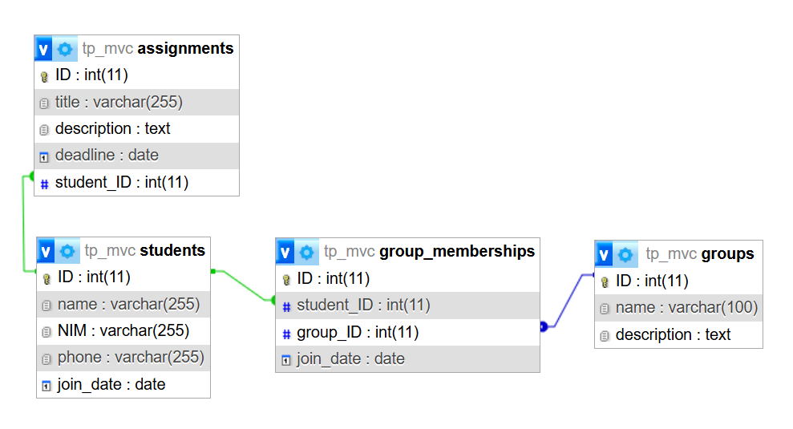

# Janji
_Saya Datuk Daneswara Raditya Samsura dengan NIM 2308224 mengerjakan Tugas Praktikum 8 pada Mata Kuliah Desain dan Pemrograman Berorientasi Objek (DPBO) untuk keberkahan-Nya maka saya tidak melakukan kecurangan seperti yang telah dispesifikasikan. Aamiin_

# Deskripsi & Desain Program

Program mengimplementasi desain arsitektur Model-View-Controller (MVC) dengan model yang terdiri dari `Student`, `Assignment`, dan `Group` untuk mengelola tugas dan grup yang terhubung pada data siswa. Untuk setiap model juga dapat diimplementasi Create-Read-Update-Delete (CRUD) sebagai metode pengelolaan data.

```plaintext
Models/
├── Student.class.php
│   ├── create ([nama], [NIM], [phone])
│   ├── read   ([ID])
│   ├── update ([ID], [nama], [NIM], [phone])
│   └── delete ([ID])
├── Group.php
│   ├── create ([nama], [description])
│   ├── read   ([ID])
│   ├── update ([ID], [nama], [description])
│   └── delete ([ID])
└── Assignment.php
    ├── create ([title], [description], [deadline], [student_ID])
    ├── read   ([ID])
    ├── update ([ID], [title], [description], [deadline], [student_ID])
    └── delete ([ID])
```

Program juga terdiri dari __4__ tabel relasional pada [tp_mvc.sql](Program/tp_mvc.sql) dengan ER-D sebagai berikut:
 

- Template yang digunakan hanya __2__, yaitu `tables.html` yang akan menampilkan tabel dari setiap model, dan `form.html` yang akan menampilkan form untuk fitur create dan update, yang mana keduanya akan me-replace indikator tertentu untuk menyesuaikan laman masing masing.
- Setiap view page memiliki 2 fungsi utama, yaitu:
  - `render()` untuk menampilkan tabel pada template page `tables.html`
  - `fill()` untuk menampilkan input form pada template page `form.html`
- Pada controller, ketiga file memiliki peran dalam mengontrol keterhubungan program dengan database (open dan close connection), dan mengelola data yang nantinya view page sudah tidak perlu mengatur data selain hanya untuk menampilkannya.

# Dokumentasi

